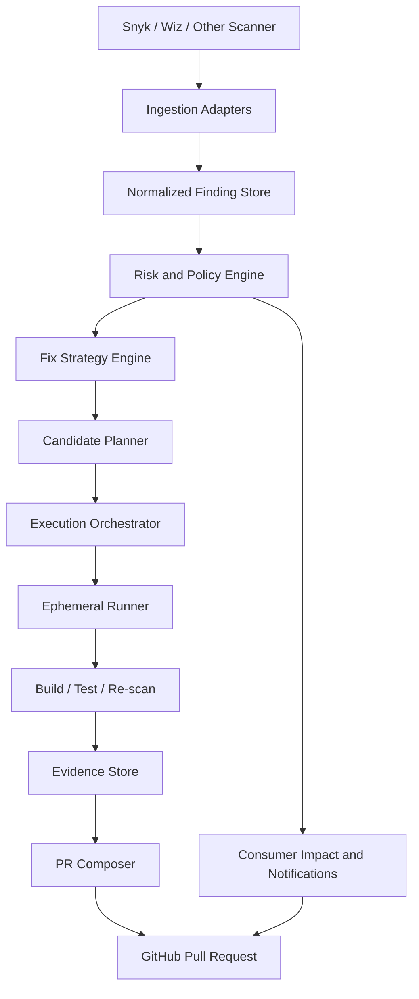

# Vulnerability Remediation Service Plan

Date: 2026-03-14
Status: Draft v1

## Goal

Build a service that ingests repository vulnerability findings from scanners such as Snyk and Wiz, selects the safest viable remediation for findings above a configurable risk threshold, validates the change in an isolated test environment, and opens a reviewable pull request with evidence and downstream communication guidance.

The service is explicitly not a scanner, not an auto-merge bot, and not a generic refactoring system.

## Product Boundaries

### In scope

- Dependency and lockfile vulnerabilities for supported ecosystems.
- Remediation strategies: update, patch, replace, mitigate.
- Breaking-change analysis before proposing a fix.
- Re-scan candidate versions so the fix does not introduce equal-or-worse known vulnerabilities.
- Docker-based execution for install, build, test, and evidence collection.
- PR generation with rollback guidance and reviewer checklist.
- Discovery and notification of known downstream consumers.

### Out of scope for v1

- Autonomous merge to default branch.
- Fully automated "replace functionality" migrations beyond narrow known replacements.
- Arbitrary code vulnerability repair outside dependency remediation.
- Broad polyglot support on day one.
- Scanner-specific UI parity with Snyk or Wiz.

## Recommended v1 Scope

Start with:

- Scanners: Snyk plus a generic normalized-ingestion adapter, with Wiz supported through that adapter first.
- Ecosystems: `npm`/`pnpm`/`yarn`, `Maven`, and `Docker` base image tags.
- SCM target: GitHub pull requests.
- Remediation automation:
  - Update direct dependencies automatically.
  - Update transitive dependencies through supported mechanisms such as overrides/resolutions/BOM updates when deterministic.
  - Patch only when an authoritative patch exists and the patch path is supported.
  - Replacement as advisory-only except for explicit curated replacements.
  - Mitigation as advisory plus code/config changes only when the mitigation is low-risk and testable.

This scoping keeps the first version tractable while covering the ecosystems most likely to benefit from existing dependency bot patterns.

## Why This Shape

Existing tooling supports parts of the workflow but not the full decision loop:

- GitHub Dependabot already opens security update PRs and supports grouped security updates, but it is intentionally scoped to dependency updates rather than repository-specific remediation strategy selection or downstream coordination.
- Renovate supports monorepos, grouped PRs, replacement PRs, and a lowest-fixed-version strategy for vulnerability PRs, which is useful prior art for batching and candidate selection.
- Snyk exposes issue APIs and fix concepts such as upgrades and patches, which makes it suitable as a scanner source rather than something to duplicate.
- OSV and the GitHub Advisory Database provide queryable advisory data that can independently validate whether a candidate version is known-vulnerable.

## Architecture

### High-level shape

Use a modular monolith control plane with isolated execution workers.

- Control plane responsibilities:
  - Scanner ingestion.
  - Normalization and deduplication.
  - Risk scoring and policy evaluation.
  - Fix-strategy selection.
  - Workflow orchestration.
  - PR generation and audit logging.
- Execution worker responsibilities:
  - Clone repo.
  - Resolve dependencies.
  - Apply updates or patches.
  - Run builds, tests, and re-scans.
  - Collect artifacts.

This should be a modular monolith first, not microservices. The workflow is complex, but team velocity is better if orchestration, policy, and evidence stay in one codebase while risky operations are isolated in workers.

### Component boundaries and interfaces

- Ingestion adapter interface:
  - input: scanner payload, webhook event, or exported report
  - output: normalized finding records plus source evidence handles
- Policy engine interface:
  - input: normalized finding, repo config, org policy
  - output: remediation eligibility, priority, required approvals
- Strategy engine interface:
  - input: eligible remediation record plus version candidates and evidence
  - output: ordered remediation plans with rationale and confidence prerequisites
- Execution orchestrator interface:
  - input: remediation plan plus repo auth and runner profile
  - output: artifact bundle, updated lockfile diff, test results, re-scan result
- PR composer interface:
  - input: approved artifact bundle plus reviewer metadata
  - output: pull request body, labels, assignees, downstream notices

These interfaces should be local module boundaries in v1, but stable enough to extract later if scale demands it.

### Proposed stack

- Control plane: TypeScript on Node.js.
- API: Fastify or NestJS.
- Queue/workflow engine: Temporal.
- Database: PostgreSQL.
- Object storage: S3-compatible bucket for artifacts.
- Execution: rootless Docker containers with per-ecosystem runner images.
- SCM integration: GitHub App.
- Observability: OpenTelemetry plus Prometheus/Grafana and structured logs.
- Policy engine: OPA or Cedar for organization-specific gating rules.

Rationale:

- The control plane is JSON-heavy, integration-heavy, and benefits from mature GitHub and LLM SDKs.
- Temporal fits retryable, long-running, stateful workflows with human checkpoints.
- Per-ecosystem runner images avoid contaminating the control-plane runtime with language toolchains.

### System diagram



## Core Workflow

### 1. Ingest

- Accept scanner findings via:
  - Scheduled pull from scanner APIs.
  - Webhook/event ingestion.
  - Uploaded report file.
- Normalize every finding into a single schema keyed by:
  - repository
  - branch
  - ecosystem
  - package URL
  - current version
  - dependency path
  - scanner finding ID
  - advisory IDs such as CVE and GHSA

Inference: Wiz public indexing is thin, so design the adapter around exported findings or GraphQL/API ingestion without hard-coding a public endpoint until tenant docs are confirmed.

### 2. Normalize and deduplicate

- Collapse duplicate findings from multiple scanners into one remediation record.
- Preserve scanner-native evidence so the PR can cite the original source.
- Distinguish:
  - direct vs transitive dependency
  - reachable vs non-reachable when the scanner provides it
  - production vs dev/test dependency
  - fixable vs partially fixable vs not fixable

### 3. Risk thresholding

Only escalate to remediation when policy passes. Default policy:

- Severity `high` or `critical`, or
- Exploit maturity above configured threshold, or
- Reachable medium severity in production path, or
- Any vulnerability affecting an internet-exposed or business-critical service.

The threshold must be repo- and org-configurable.

### 4. Fix strategy selection

Use the following decision order:

1. Lowest safe direct update.
2. Deterministic transitive update via supported override mechanism.
3. Authoritative patch.
4. Curated replacement.
5. Mitigation plus human review.

A strategy is considered valid only if:

- It removes or materially reduces the triggering vulnerability.
- It does not introduce a same-or-higher severity known vulnerability in the proposed target version.
- It passes compatibility gates.
- It passes minimum confidence thresholds.

If no candidate meets those conditions, the record moves to report-only mode with recommended manual action.

### 5. Execute in sandbox

- Clone the repo at the target branch.
- Restore dependencies using the package manager native lockfile flow.
- Apply the proposed change.
- Build and test inside an ephemeral runner image.
- Re-scan the updated dependency graph or lockfile.
- Collect results and destroy the environment.

### 6. Generate PR and communication artifacts

- Open a PR only when confidence is above threshold.
- Otherwise create a remediation report or issue with recommended manual action.

## Normalized Data Model

Each remediation record should include:

- `finding_id`
- `source_system`
- `repository`
- `branch`
- `manifest_path`
- `ecosystem`
- `package_name`
- `purl`
- `current_version`
- `candidate_fixed_versions`
- `dependency_type` (`direct`, `transitive`, `base_image`)
- `dependency_path`
- `severity`
- `cvss`
- `epss` if available
- `exploit_maturity`
- `reachable`
- `runtime_exposure`
- `advisory_ids`
- `scanner_evidence_urls`
- `introduced_via`
- `fix_types_available`
- `breaking_change_risk`
- `new_vuln_risk`
- `confidence_score`
- `recommended_strategy`
- `decision_rationale`
- `downstream_consumers`
- `status`

## Strategy Engine

### Strategy A: Update dependency version

Use when:

- A fixed version exists.
- The update path is deterministic.
- Compatibility risk is acceptable.

Selection rule:

- Prefer the lowest fixed version first.
- Escalate to a higher version only if the lowest fixed version still violates policy, fails tests, or creates other blocked conflicts.

This follows the same general logic Renovate exposes through `vulnerabilityFixStrategy=lowest`, which is the right default for minimizing change surface.

### Strategy B: Apply patch

Use when:

- No acceptable update path exists, or the update is breaking and too risky.
- A patch is available from an authoritative source.
- The patch can be reproduced and audited in the runner.

For v1, support patching only where the path is well-defined and auditable. Snyk documents patch-based remediation, but also documents that patching support is ecosystem-limited, so patch automation should be plugin-based rather than global.

### Transitive dependency conflict resolution

Use a deterministic sequence:

1. Attempt native override or resolution mechanisms.
2. Re-resolve the dependency graph and diff the full lockfile.
3. Reject the candidate if unrelated high-risk churn appears in the lockfile.
4. If the graph remains unsatisfied, try the next safe candidate version.
5. If no deterministic graph can be produced, downgrade to report-only mode.

Never open a PR from an unresolved or partially resolved dependency graph.

### Strategy C: Replace functionality

Use when:

- The package is deprecated, abandoned, malicious, or repeatedly vulnerable.
- There is a curated replacement map.

v1 rule:

- Automated replacement is advisory-only unless the replacement is in a curated allowlist with migration instructions and compatibility tests.

This is the biggest scope trap in the original request. General replacement is a refactoring problem, not a dependency update problem.

### Strategy D: Implement mitigation

Use when:

- No safe package update exists.
- A mitigation is lower-risk than waiting.

Examples:

- Disable a vulnerable feature flag.
- Tighten input validation around a vulnerable code path.
- Pin config to avoid the affected execution mode.
- Add network or runtime restrictions.

Mitigations should always create follow-up work for a permanent fix.

## Breaking Change Analysis

Breaking-change analysis should be layered and explicit.

### Signals

- Semantic version delta.
- Release notes or changelog entries.
- Registry metadata and deprecation notices.
- Public API diff tooling where available.
- Existing call sites in the repository.
- Contract and integration test coverage around those call sites.

### Process

1. Fetch candidate release notes from package registry metadata or source repository tags/releases.
2. Run ecosystem-specific compatibility analyzers where practical.
3. Extract code references to affected package APIs from the repo.
4. Ask the LLM to summarize likely breaking changes only after structured evidence is attached.
5. Fail closed when the only signal is an LLM summary and the change is major-version or high impact.

LLM output is an explanation layer, not the primary compatibility oracle.

## Candidate Version Safety

For each candidate version:

1. Query GitHub Advisory Database and OSV for advisory overlap.
2. Query scanner-native intelligence when available.
3. Reject a candidate if it introduces:
   - any new `critical`
   - a new `high` in the same repo scope
   - more total unresolved vulnerabilities than baseline unless policy explicitly allows it
4. Re-scan the post-change lockfile or manifest in the runner.

The service should maintain a candidate ledger so the same bad version is not retried repeatedly.

## Docker Test Environment

### Runner model

- One immutable runner image per ecosystem and major toolchain.
- Rootless containers only.
- Read-only base image with writable workspace mount.
- No host Docker socket mounted into the job container.
- Outbound network restricted to allowlisted registries and source hosts.

### Repository mounting

- Control plane creates a short-lived workspace volume.
- Runner clones from SCM using a short-lived installation token.
- Secrets are injected ephemerally and never written to artifacts.

### Cleanup

- Hard TTL on every job.
- Force-delete workspace and credentials on completion or timeout.
- Artifact retention policy by severity and audit need.

## Test and TDD Strategy

The original request asks for TDD-level confidence. In practice, v1 should implement targeted test augmentation plus strict confidence gating.

### Existing tests

- Always run the repository's existing unit, integration, and contract tests first.
- Treat flaky suites as a signal against auto-PR creation unless the flake is known and pre-existing.

### Generated tests

Generate tests only for narrow, evidence-backed cases:

- Characterization tests around changed dependency call sites.
- Regression tests around the vulnerability trigger where a reproducer exists.
- Contract tests for known public endpoints or SDK surfaces touched by the change.

### Confidence scoring

Confidence should combine:

- Test pass rate.
- Coverage of changed dependency touchpoints.
- Whether public APIs touched by the upgrade are exercised.
- Whether generated tests survive mutation or negative checks.
- Whether advisory re-scan is clean.
- Whether breaking-change analysis found unresolved major risks.

Default PR threshold:

- `0.80` or higher for patch or minor updates.
- `0.90` or higher for major updates.
- Anything below threshold produces a report, not a PR.

## External Consumers and Downstream Impact

This cannot be fully discovered from code alone, so the service needs explicit repository metadata.

### Required repo config

Add a config file such as `.vuln-remediation.yml` with:

- service criticality
- supported ecosystems
- private registry details
- downstream services or SDK consumers
- contract test locations
- integration test owners
- public API surface hints
- notification channels
- allowed remediation strategies

### Discovery signals

- OpenAPI or gRPC specs.
- Published packages from the same repo.
- SDK directories.
- Known dependent repos from internal catalog or Backstage.
- Deployment manifests and service ownership metadata.

### Communication outputs

Every PR should include:

- consumer impact summary
- whether integration tests require updates
- affected contracts or APIs
- Slack or ticket draft for dependent teams when needed

## PR Batching and Grouping Strategy

Default to one PR per remediation unit, not one PR per CVE.

Recommended unit:

- same repo
- same ecosystem
- same manifest set
- compatible remediation path

Rules:

- Batch multiple advisories fixed by the same dependency update.
- Batch related lockfile updates in the same workspace.
- Never batch unrelated major upgrades together.
- Allow policy-based grouped security PRs for low-risk patch/minor updates, similar to grouped security updates in Dependabot.

## Reviewer Checklist

Every PR should require reviewers to confirm:

- the chosen strategy is the lowest-risk viable option
- the target version is not known-vulnerable in the attached evidence
- changelog and compatibility notes were reviewed
- existing tests passed in the isolated runner
- any generated tests are relevant and non-trivial
- downstream consumer impact is acknowledged
- rollback instructions are sufficient
- any major-version change has explicit owner approval

## Monorepo Support

The service must treat a monorepo as multiple execution targets with shared policy.

Model:

- Detect packages, services, and manifests independently.
- Compute a dependency graph of manifests to applications.
- Run impact analysis per target and aggregate when a shared dependency affects multiple packages.
- Prefer one PR per affected bounded context unless the lockfile is globally shared.

Renovate's documented monorepo support is a useful prior-art reference here; the service should borrow its grouping discipline, not reinvent it blindly.

## Priority Ordering for Multiple Vulnerabilities

Sort by:

1. Actively exploited or high exploit maturity.
2. Reachable production vulnerability.
3. Internet-exposed service.
4. Critical business service ownership.
5. Lowest-change safe fix available.
6. Number of findings removed by the same remediation.

This avoids spending expensive runner capacity on low-value fixes first.

## Semantic Versioning Policy

Semver is a signal, not a guarantee.

Policy:

- Patch update: auto-eligible if other gates pass.
- Minor update: auto-eligible if changelog and tests are clean.
- Major update: requires stronger confidence and usually explicit owner approval unless the package is already pinned within a compatible abstraction boundary.

Additional rule:

- If a package has a history of non-semver behavior, downgrade trust and require stricter gates even for minor or patch bumps.

## LLM Guardrails

LLM use is allowed only in bounded roles:

- summarize release notes
- extract likely breaking changes from attached evidence
- draft PR text and downstream communications
- propose tests around clearly identified call sites

LLM use is not allowed to:

- invent fixes without package-manager validation
- decide final mergeability
- override failing scanners or tests
- claim compatibility without evidence

Controls:

- every LLM decision must cite structured evidence IDs
- deterministic tools run before LLM reasoning
- low-confidence outputs route to report-only mode
- prompts and outputs are logged for audit

## Operational Concerns

### Error handling

- Idempotent ingestion keyed by scanner finding ID plus repo plus version.
- Retry transient API and registry failures with backoff.
- Mark permanent failures with explicit operator reason codes.

### Observability

- Trace every remediation from finding to PR or report.
- Emit metrics for:
  - ingestion lag
  - candidate rejection reasons
  - test pass rate
  - false-positive or false-safe reversals
  - time to PR
  - PR acceptance rate

## Scale Considerations

For large organizations, cost control and queue discipline matter as much as correctness.

- Deduplicate findings across scanners before scheduling runners.
- Cache advisory and package metadata aggressively with short TTLs.
- Enforce per-repo and per-org concurrency limits.
- Prioritize cheap candidate evaluation before expensive runner execution.
- Reuse warm runner images, but never reuse mutable workspaces.
- Cap auto-created PRs per repo per day and spill excess work into a ranked queue.
- Support report-only mode for backlog shaping when the queue is saturated.

### Configuration management

- Org-level defaults.
- Repo-level overrides in `.vuln-remediation.yml`.
- Secrets managed in the platform secret store, not repo config.

### Rollback

- PR body includes exact files changed, candidate version rationale, and revert steps.
- Optional follow-up revert PR can be generated from stored evidence if regression is reported.

## Security Model

- GitHub App with least-privilege repo permissions.
- Short-lived scanner and registry credentials.
- No persistent source checkout outside runner.
- Artifact redaction before persistence.
- Isolation between repos at runner and secret scope.

## Suggested Repository Config

```yaml
version: 1
riskThreshold:
  minSeverity: high
  allowReachableMedium: true
supportedEcosystems:
  - npm
  - maven
  - docker
strategies:
  allow:
    - update
    - patch
    - mitigate
  replacementMode: advisory
consumers:
  - name: billing-api
    type: service
    contractTests: services/billing-api/contracts
notifications:
  slackChannel: "#security-remediation"
  jiraProject: SEC
confidence:
  defaultMin: 0.8
  majorMin: 0.9
```

## PR Template

Every remediation PR should contain:

- triggering findings and advisory IDs
- chosen strategy
- rejected alternatives and why
- current version to target version
- breaking-change summary
- new-vulnerability check result
- test evidence summary
- downstream consumer impact
- reviewer checklist
- rollback instructions

## Delivery Roadmap

### Phase 1

- Snyk ingestion.
- Generic finding import adapter.
- GitHub PR creation.
- npm and Maven support.
- Lowest-safe-version updates.
- Existing test execution.
- Advisory cross-check with OSV and GitHub Advisory Database.

### Phase 2

- Deterministic transitive remediation.
- Docker base image remediation.
- Generated characterization tests.
- Consumer metadata and notifications.
- Grouped low-risk PRs.

### Phase 3

- Curated replacements.
- More ecosystems.
- Internal service-catalog integration.
- Approval workflows for major upgrades.

## Open Questions

- Which source of truth owns "external consumers": Backstage, repo config, or both?
- Is Wiz expected as a first-class API integration on day one, or is normalized import sufficient initially?
- Are private package registries common enough to require self-hosted runners immediately?
- Does the organization want report-only mode first before enabling write access for PR creation?

## Coverage Against Recovered Criteria

The recovered PRD listed 47 positive criteria and 3 anti-criteria. This document covers all of them at the planning level:

- ISC-1 to ISC-4: ingestion and normalized model
- ISC-5 to ISC-7: thresholding and decision criteria
- ISC-8 to ISC-12: four strategies and decision tree
- ISC-13 to ISC-17: changelog sourcing, compatibility, advisory cross-check
- ISC-18 to ISC-21: Docker runner, isolation, teardown, repo mounting
- ISC-22 to ISC-25: generated tests, execution, confidence scoring, existing suite handling
- ISC-26 to ISC-28: consumer discovery, impact assessment, communications
- ISC-29 to ISC-31: PR structure, evidence, reviewer checklist
- ISC-32 to ISC-35: architecture, boundaries, stack, data flow
- ISC-36 to ISC-39: failure handling, observability, config, rollback
- ISC-40 to ISC-47: transitive conflicts, priority, monorepos, scope, batching, guardrails, scale, semver
- ISC-A-1 to ISC-A-3: no autonomous merge, no scanner duplication, no single-scanner lock-in

## Sources

- Snyk Issues API: https://docs.snyk.io/snyk-api/reference/issues
- Snyk remediation and patch docs: https://docs.snyk.io/scan-with-snyk/snyk-open-source/manage-vulnerabilities
- GitHub Dependabot docs: https://docs.github.com/en/code-security/how-tos/secure-your-supply-chain/manage-your-dependency-security
- GitHub Dependabot version updates: https://docs.github.com/en/code-security/how-tos/secure-your-supply-chain/secure-your-dependencies/configuring-dependabot-version-updates
- GitHub Advisory Database docs: https://docs.github.com/en/code-security/how-tos/report-and-fix-vulnerabilities/fix-reported-vulnerabilities/browsing-security-advisories-in-the-github-advisory-database
- Renovate documentation: https://docs.renovatebot.com/
- Renovate vulnerability alert options: https://docs.renovatebot.com/configuration-options/
- OSV API docs: https://google.github.io/osv.dev/api/
- OSV quickstart: https://google.github.io/osv.dev/quickstart/
- Wiz code security context:
  - https://www.wiz.io/blog/wiz-code-unify-security-across-github-gitlab-and-azure-repos
  - https://www.wiz.io/academy/application-security/code-security
